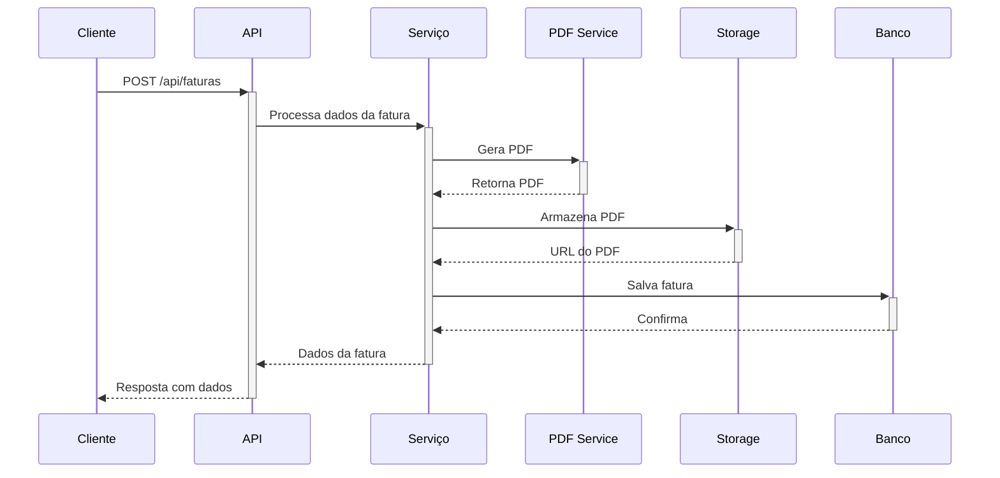
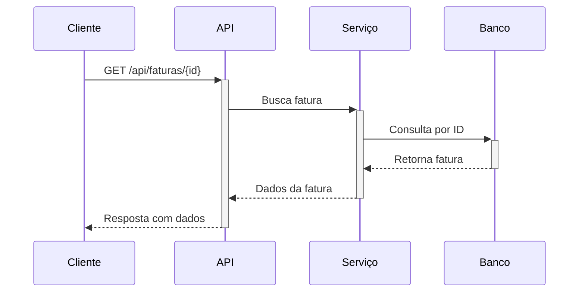
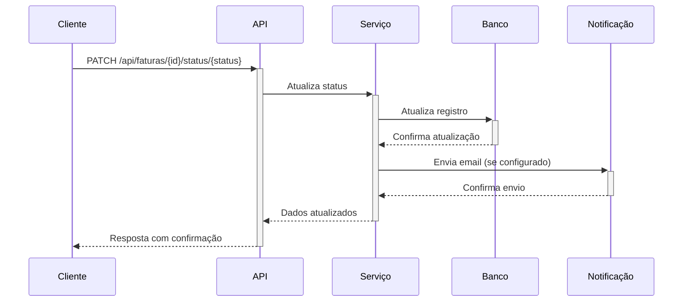

# 💰 Fatura Rápida - MicroSaaS

Solução completa para geração e gerenciamento de faturas profissionais em PDF. Automatize o processo de cobrança e envio de faturas para seus clientes.

✨ **Destaques:**
- Geração automática de PDFs profissionais
- Armazenamento seguro das faturas
- Controle de status de pagamento
- API RESTful para integração
- Pronto para produção

## 🎯 Visão do Produto

O Fatura Rápida foi desenvolvido para empreendedores e pequenas empresas que precisam:

✅ **Automatizar cobranças** - Gere faturas recorrentes automaticamente  
✅ **Economizar tempo** - Elimine processos manuais de criação de faturas  
✅ **Manter-se organizado** - Todas as faturas centralizadas e fáceis de acessar  
✅ **Pensando em escalar** - Arquitetura preparada para crescer com seu negócio

### Como Funciona

1. **Criação da Fatura**
   - Informe os dados do cliente e itens
   - Defina data de vencimento e condições

2. **Geração do PDF**
   - Layout profissional gerado automaticamente
   - Personalização com sua marca
   - Armazenamento seguro

3. **Gerenciamento**
   - Acompanhe status de pagamento
   - Envie lembretes automáticos
   - Gere relatórios financeiros

## 🛠️ Arquitetura e Tecnologias

### Backend
- **Linguagem:** Kotlin 1.9+ (Conciso e seguro)
- **Framework:** Spring Boot 3.2.4 (Robusto e maduro)
- **Banco de Dados:**
  - H2 (Desenvolvimento/Testes)
  - PostgreSQL (Produção - recomendado para produção)

### Principais Bibliotecas
- **Spring Data JPA** - Persistência de dados
- **Flyway** - Controle de migrações do banco
- **OpenAPI** - Documentação da API
- **iText PDF** - Geração profissional de PDFs
- **JUnit 5** - Testes automatizados

### Por que esta Stack?
- **Produtividade:** Spring Boot acelera o desenvolvimento
- **Confiabilidade:** Tecnologias estáveis e bem suportadas
- **Escalabilidade:** Pronto para crescer com seu negócio

## 🚀 Começando

### Pré-requisitos

- JDK 17+ (Recomendado: Amazon Corretto 17)
- Gradle 8.0+
- Docker (opcional, mas recomendado para o banco de dados)

### Configuração Rápida

1. **Clone o repositório**
   ```bash
   git clone https://github.com/seu-usuario/fatura-rapida.git
   cd fatura-rapida
   ```

2. **Configure as variáveis de ambiente**
   Crie um arquivo `.env` na raiz:
   ```env
   # Banco de Dados
   SPRING_DATASOURCE_URL=jdbc:postgresql://localhost:5432/faturarapida
   SPRING_DATASOURCE_USERNAME=postgres
   SPRING_DATASOURCE_PASSWORD=postgres
   
   # Configurações da Aplicação
   APP_ENV=dev
   ```

3. **Inicie o banco de dados** (com Docker)
   ```bash
   docker-compose up -d
   ```

4. **Execute a aplicação**
   ```bash
   # Modo desenvolvimento (com recarregamento automático)
   ./gradlew bootRun --args='--spring.profiles.active=dev'
   ```

5. **Acesse a documentação**
   - Swagger UI: http://localhost:8080/api/swagger-ui.html
   - OpenAPI JSON: http://localhost:8080/api/v3/api-docs

## 📚 Documentação da API

A API segue o padrão RESTful e está totalmente documentada com OpenAPI. Você pode explorar todos os endpoints através do Swagger UI.

### Endpoints Principais

| Método | Endpoint | Descrição |
|--------|----------|------------|
| POST   | `/api/faturas` | Cria uma nova fatura |
| GET    | `/api/faturas` | Lista todas as faturas |
| GET    | `/api/faturas/{id}` | Busca uma fatura por ID |
| GET    | `/api/faturas/{id}/pdf` | Baixa o PDF de uma fatura |
| PATCH  | `/api/faturas/{id}/status/{status}` | Atualiza o status de uma fatura |

### Exemplo de Requisição

```bash
curl -X POST 'http://localhost:8080/api/faturas' \
  -H 'Content-Type: application/json' \
  -d '{
    "cliente": "Cliente Exemplo",
    "descricao": "Serviços de desenvolvimento",
    "valor": 1500.00,
    "vencimento": "2025-06-30",
    "documentoCliente": "123.456.789-00",
    "enderecoCliente": "Av. Exemplo, 123"
  }'

## 🔄 Fluxo do Sistema

### 1. Criação de Fatura


### 2. Consulta de Fatura


### 3. Atualização de Status


## 🏗️ Estrutura do Código

```
faturarapida/
├── src/
│   ├── main/
│   │   ├── kotlin/com/faturarapida/
│   │   │   ├── config/          # Configurações globais
│   │   │   │   ├── OpenApiConfig.kt    # Documentação
│   │   │   │   ├── StorageConfig.kt    # Armazenamento
│   │   │   │   └── WebConfig.kt        # Web e CORS
│   │   │   │
│   │   │   ├── controller/      # Endpoints da API
│   │   │   │   └── InvoiceController.kt # Rotas de faturas
│   │   │   │
│   │   │   ├── dto/            # Objetos de Transferência
│   │   │   │   ├── CreateInvoiceRequest.kt
│   │   │   │   └── InvoiceResponse.kt
│   │   │   │
│   │   │   ├── exception/      # Tratamento de erros
│   │   │   │   └── GlobalExceptionHandler.kt
│   │   │   │
│   │   │   ├── model/          # Entidades JPA
│   │   │   │   ├── Invoice.kt
│   │   │   │   └── enums/InvoiceStatus.kt
│   │   │   │
│   │   │   ├── repository/     # Acesso a dados
│   │   │   │   └── InvoiceRepository.kt
│   │   │   │
│   │   │   └── service/        # Lógica de negócios
│   │   │       ├── InvoiceService.kt
│   │   │       ├── PdfService.kt
│   │   │       └── storage/StorageService.kt
│   │   │
│   │   └── resources/
│   │       ├── db/migration/    # Migrações do banco
│   │       ├── application.yml  # Configurações principais
│   │       └── application-dev.yml  # Config de desenvolvimento
│   │
│   └── test/                   # Testes automatizados
│       └── kotlin/com/faturarapida/
│           ├── service/InvoiceServiceTest.kt
│           └── controller/InvoiceControllerTest.kt
│
├── docker/                     # Configurações Docker
│   ├── docker-compose.yml       # Serviços (PostgreSQL, etc)
│   └── Dockerfile              # Imagem da aplicação
│
├── .github/workflows/         # CI/CD (GitHub Actions)
│   └── build-and-deploy.yml
│
├── .env.example              # Exemplo de variáveis de ambiente
├── build.gradle.kts            # Dependências e build
└── README.md                   # Este arquivo
```

## 🚀 Próximos Passos

### Melhorias Imediatas
- [ ] Implementar autenticação JWT
- [ ] Adicionar sistema de templates de faturas
- [ ] Configurar envio de emails automáticos
- [ ] Criar dashboard administrativo

### Roadmap

#### Fase 1: MVP (Agora)
- [x] CRUD de faturas
- [x] Geração de PDF
- [x] API REST documentada

#### Fase 2: Automação
- [ ] Sistema de templates
- [ ] Agendamento de cobranças
- [ ] Integração com gateways de pagamento

#### Fase 3: Escalabilidade
- [ ] Multi-tenancy
- [ ] Filas para processamento assíncrono
- [ ] Cache para melhor performance

## 🔧 Desenvolvimento

### Executando os Testes
```bash
# Todos os testes
./gradlew test

# Apenas testes de integração
./gradlew integrationTest

# Com cobertura de código
./gradlew jacocoTestReport
```

### Padrões de Commit
- `feat:` Nova funcionalidade
- `fix:` Correção de bug
- `docs:` Documentação
- `style:` Formatação
- `refactor:` Refatoração de código
- `test:` Adição/atualização de testes
- `chore:` Atualização de tarefas de build

Exemplo:
```bash
git commit -m "feat: adiciona geração de relatório mensal"

## 🔒 Segurança

### Medidas Implementadas
- **Validação de Entrada**: Todas as entradas são validadas
- **Proteção contra SQL Injection**: Uso de parâmetros preparados
- **CORS Configurado**: Apenas origens permitidas
- **Sem Dados Sensíveis em Logs**: Dados sensíveis são ofuscados

### Próximas Medidas
- [ ] Autenticação JWT
- [ ] Rate Limiting
- [ ] Auditoria de Acessos
- [ ] Criptografia de Dados Sensíveis

### Boas Práticas Recomendadas
1. Use HTTPS em produção
2. Mantenha as dependências atualizadas
3. Monitore os logs de acesso
4. Faça backups regulares do banco de dados

## 🚀 Implantação

### Opção 1: Docker (Recomendado)
```bash
# Construir a imagem
docker build -t fatura-rapida .

# Executar com variáveis de ambiente
docker run -p 8080:8080 \
  -e SPRING_DATASOURCE_URL=jdbc:postgresql://db:5432/faturarapida \
  -e SPRING_DATASOURCE_USERNAME=user \
  -e SPRING_DATASOURCE_PASSWORD=password \
  fatura-rapida
```

### Opção 2: Executável JAR
```bash
# Gerar o JAR
./gradlew bootJar

# Executar
java -jar build/libs/faturarapida-0.0.1-SNAPSHOT.jar \
  --spring.profiles.active=prod \
  --spring.datasource.url=jdbc:postgresql://localhost:5432/faturarapida \
  --spring.datasource.username=user \
  --spring.datasource.password=password
```

### Variáveis de Ambiente Importantes

| Variável | Descrição | Exemplo |
|----------|-----------|---------|
| `SPRING_PROFILES_ACTIVE` | Perfil ativo | `prod` |
| `SPRING_DATASOURCE_URL` | URL do banco | `jdbc:postgresql://localhost:5432/faturarapida` |
| `SPRING_DATASOURCE_USERNAME` | Usuário do banco | `user` |
| `SPRING_DATASOURCE_PASSWORD` | Senha do banco | `s3nh4s3gur4` |
| `APP_STORAGE_DIR` | Diretório de armazenamento | `/var/lib/faturas` |

## 📊 Monitoramento

A API inclui endpoints de monitoramento (quando o Spring Actuator estiver habilitado):

- Health: `/api/actuator/health`
- Info: `/api/actuator/info`
- Metrics: `/api/actuator/metrics`

## 🤝 Contribuindo

1. Faça um fork do projeto
2. Crie uma branch para sua feature (`git checkout -b feature/AmazingFeature`)
3. Commit suas mudanças (`git commit -m 'Add some AmazingFeature'`)
4. Push para a branch (`git push origin feature/AmazingFeature`)
5. Abra um Pull Request

## 📝 Licença

Distribuído sob a licença MIT. Veja `LICENSE` para mais informações.

## 📞 Suporte

Para suporte, entre em contato por email ou abra uma issue no repositório.

---

Feito com ❤️ por [Seu Nome] - [@seu_twitter](https://twitter.com/seu_twitter)

## 🤝 Contribuição

1. Faça um Fork do projeto
2. Crie uma Branch (`git checkout -b feature/AmazingFeature`)
3. Commit suas mudanças (`git commit -m 'Add some AmazingFeature'`)
4. Push para a Branch (`git push origin feature/AmazingFeature`)
5. Abra um Pull Request

## 📄 Licença

Este projeto está sob a licença MIT - veja o arquivo [LICENSE](LICENSE) para detalhes.

---

Desenvolvido por [Murilo Albuquerque](https://github.com/muriloalbuquerque)  
[](https://x.com/MuriloAlbu13279)  
[](https://www.linkedin.com/in/murilo-albuquerque-dev/)
=======
# 🧾 Fatura Rápida

O **Fatura Rápida** é um microSaaS que automatiza a criação e o envio de faturas em PDF por e-mail, oferecendo uma solução simples e eficiente para freelancers, autônomos e pequenos negócios.

---

## 🚀 Tecnologias Utilizadas

- **Kotlin + Spring Boot** — Backend robusto e moderno
- **PostgreSQL** — Banco de dados relacional
- **iText** — Biblioteca para geração de PDF
- **SendGrid** — Serviço de envio de e-mails
- **Railway** — Plataforma de deploy simplificada

---

## 📦 Funcionalidades (MVP)

- [x] Estrutura base do projeto
- [ ] Criar fatura com dados do cliente
- [ ] Gerar arquivo PDF automaticamente
- [ ] Enviar fatura por e-mail
- [ ] Consultar faturas emitidas via API

---

## 📋 Tarefas Backend (Dia 2)

- [ ] Implementar geração de PDF com iText
  - Layout com logo no topo e tabela de dados
  - Arquivo salvo com UUID único
- [ ] Criar `InvoiceService` com método `criarFatura(request: InvoiceRequest)`
  - Validar dados
  - Gerar e salvar PDF
  - Persistir `Invoice` no banco
- [ ] Integrar envio de e-mail com SendGrid
  - PDF em anexo
  - Usar `EmailService` separado
- [ ] Criar endpoint `GET /api/invoices`
  - Listar faturas com dados básicos

---

## 👨‍💻 Time

- Backend: [Murilo Albuquerque](https://github.com/muriloalbuquerque)
- Frontend: *[Nome do colaborador]* (adicionar quando disponível)

---

## 📄 Licença

Projeto com fins educacionais e comerciais. Licença a definir.
>>>>>>> main
